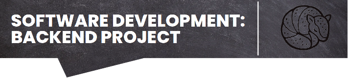
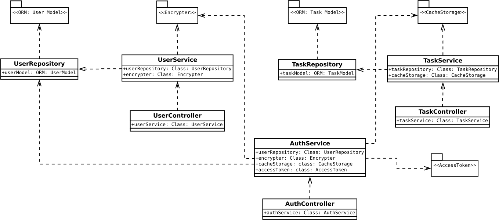
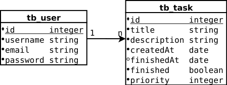
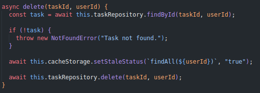
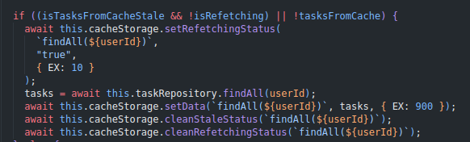
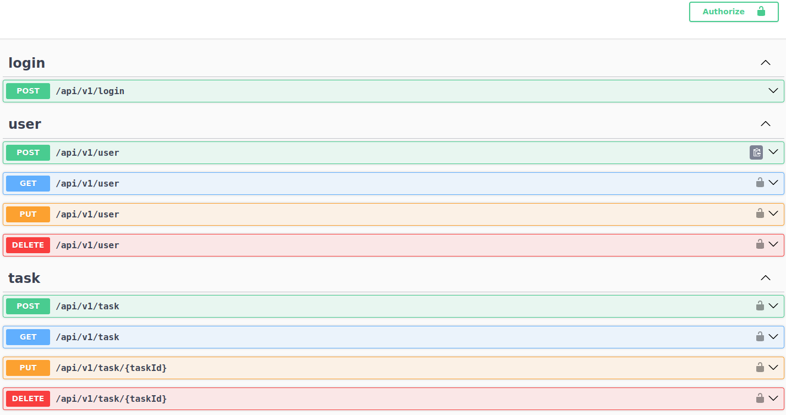

<p align="center">
  
</p>

# **To-Do List API with NodeJs + Express + PostgreSQL**

First of all, what is a To-Do List? It is a list of all the tasks that you need to complete. In summary, it lists all the things you need to do, ordered by priority.

At first glance, this project may appear similar to any other to-do list project, but it's not. This API aims to put into practice a variety of backend development concepts necessary to build a robust backend project.

What concepts will you find in this project?

1. Layered pattern (repository, service, controller);
2. Unit and integration tests;
3. Database containerization;
4. Clean Code principles;
5. SOLID principles like single responsibility and dependency injection;
6. Caching;

<summary><h2>1. Project Information</h2></summary>
<details>
<summary>Show info</summary>

<br>

- Node version: 18.16.0
- Framework: Express
- Database: PostgreSQL + Redis (cache)
- ORM: Sequelize
- Design Pattern: Layered Architecture + Composition Root
- Authentication: Json Web Token
- Validation: Joi
- Tests: Jest
- Logs: Winston

</details>

<summary><h2>2. Locally Project Setup</h2></summary>
<details>
<summary>Show info</summary>

<br>

- Create a `.env` file following the `.env.example` structure and fill all information about server, database, security and log configurations.

```
# Server configurations
PORT=

# Database configurations
DB_HOST_DEV=
DB_PORT_DEV=
DB_USER_DEV=
DB_PASSWORD_DEV=
DB_NAME_DEV=

DB_HOST_TEST=
DB_PORT_TEST=
DB_USER_TEST=
DB_PASSWORD_TEST=
DB_NAME_TEST=

# Jwt configurations
SECRET_KEY=

# Log configuration
LOG_LEVEL=
```

- Install all the required packages using the following command `npm install`. And start the project with the following scripts.

### - Scripts:

1. This script will start the project with the production environment

```
npm run start
```

2. The following script will start the project with the development environment, starting postgresql and redis containers

```
npm run start:dev
```

3. The next script will run the unit tests, starting postgresql and redis containers with the test databases

```
npm run test:unit
```

4. The last script will run the integration tests, starting postgresql and redis containers with the test databases

```
npm run test:int
```

</details>

<summary><h2>3. Project Structure</h2></summary>
<details>
<summary>Show info</summary>

<br>

- The project is structured following the layered pattern, that we have first a repository layer as a dependency of the service layer as a dependency of the controller layer. Every class is contructed using abstract classes that all will be coupled in a composition root layer.

<p align="center">
  
</p>

- Every class was build with abstract dependencies to improve the flexibility and scalability of the code. And after all the dependencies are injected using de composition root pattern, that is simillar to the factory pattern.

- Database

<p align="center">
  
</p>

- The cached data is controlled by flags, when the database is changed the flag stale is set to true and inform to the method responsible for load all tasks to refecthing the data and the refecthing flag is set to true too, to inform that the data is already been renewed. Like the following example, when some task is deleted and the flag stale is seted to true;

<p align="center">
  
</p>

- And then in the TaskService findAll method the flag isStale will be checked and if other request already by refecthing the data, if the value of the flag stale was true and any other request is refecthing the data, the list of the taks will be renewed.

<p align="center">
  
</p>

</details>

<summary><h2>4. Endpoints</h2></summary>
<details>
<summary>Show info</summary>

<br>

- In this API is possible to do de all CRUD operations for user details and tasks too. In addition to presenting an authentication route that generates a token that allows access to other protected routes.

- You can access all endpoints and their details in the following route, which was written using the swagger tool and following the open api specification:

```
http://localhost:PORT/api-docs/
```

<p align="center">
  
</p>

</details>

<summary><h2>5. How to contribute?</h2></summary>
<details>
<summary>Show info</summary>

<h3>1. Fork this repository</h3>

<h3>2. Clone the repository</h3>

Open a terminal and run the following git command:

```
git clone "url you just copied"
```

<h3>3. Create a branch</h3>

```
git checkout -b your-new-branch-name
```

<h3>4. Make necessary changes and commit those changes</h3>

Add those changes to the branch you just created using the following command:

```
git add .
```

Now commit those changes using following command:

```
git commit -m "Briefly describe the changes made"
```

<h3>5. Push changes to GitHub</h3>

Push your changes using the following command:

```
git push -u origin your-branch-name
```

<h3>6. Submit your changes for review on GitHub</h3>

<br>

</details>

<h2>Contact Information:</h2>

- Questions and feedbacks are very welcome.

- Email: lukas.veiga10@gmail.com
