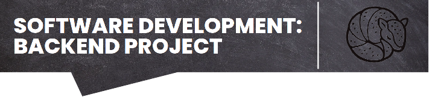

  

# **To-Do List API with NodeJs + Express + PostgreSQL**

First of all, what is a To-Do List? It is a list of all the tasks that you need to complete. In summary, it lists all the things you need to do, ordered by priority.

At first glance, this project may appear similar to any other to-do list project, but it's not. This API aims to put into practice a variety of backend development concepts necessary to build a robust backend project.

What concepts will you find in this project?

1. Layered pattern (repository, service, controller);
2. Unit and integration tests;
3. Database containerization;
4. Clean Code principles;
5. SOLID principles like single responsibility and dependency injection;
6. Caching;
